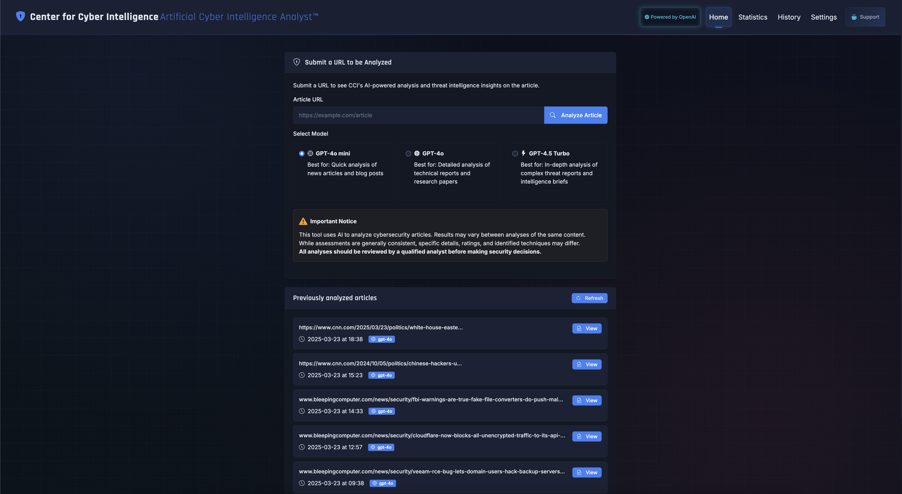

# Artificial Cyber Intelligence Analyst 
[](https://github.com/CenterforCyberIntelligence/ThreatInsight-Analyzer)
[](https://github.com/CenterforCyberIntelligence/ThreatInsight-Analyzer)
[](LICENSE.md)
[](https://github.com/CenterforCyberIntelligence/ThreatInsight-Analyzer)
[](https://github.com/CenterforCyberIntelligence/ThreatInsight-Analyzer/stargazers)
[](https://github.com/CenterforCyberIntelligence/ThreatInsight-Analyzer/network/members)

A web-based tool that uses AI to aid in rapid summarization and analysis of cybersecurity articles to generate structured threat intelligence insights.

## Table of Contents

- [Current Status](#current-status)
- [Documentation](#documentation)
  - [README.md](README.md) - Project overview and getting started
  - [CHANGELOG.md](CHANGELOG.md) - Version history and updates
  - [Known Issues.md](Known%20Issues.md) - Current and resolved issues
  - [TODO.md](TODO.md) - Future development roadmap
  - [LICENSE.md](LICENSE.md) - License information
- [Technology Overview](#technology-overview)
- [Version](#version)
- [Features](#features)
- [Interface Preview](#interface-preview)
- [Project Structure](#project-structure)
- [Installation](#installation)
- [Configuration](#configuration)
  - [URL Validation Configuration](#url-validation-configuration)
  - [Environment Variable Configuration](#environment-variable-configuration)
- [Available Models](#available-models)
- [Running the Application](#running-the-application)
- [Usage](#usage)
- [Development Status](#development-status)
- [Database Structure](#database-structure)
  - [Tables](#tables)
  - [Database Functions](#database-functions)
- [Security Notes](#security-notes)
- [Testing](#testing)
- [Disclaimer](#disclaimer)
- [License](#license)
- [Startup Optimizations](#startup-optimizations)

## Current Status

This project is in active development. Features are being implemented incrementally, and the codebase is evolving. Known issues are documented in the [Known Issues](Known%20Issues.md) file. If you are a fan of this project and want to see it keep growing, consider adding some fuel to the tank. 

<div align="center">
  <a href="https://buymeacoffee.com/centerforcyberintel" target="_blank">
    
  </a>
  <p>
</div>

> **IMPORTANT NOTICE**: This is a ✨ vibe-coding ✨ project I started because I wanted a rapid way to summarize and extract critical intelligence information from articles I read on the internet. Because I am not a developer by trade, and I am heavily relying on AI Agents to support my develoment of this platform, bugs and issues are expected. Use at your own risk and enjoy the process. If you have suggestions on how to improve the project, please let me know!

## Technology Overview

- **Backend**: Python with Flask for the web framework
- **Frontend**: HTML, CSS, and JavaScript with HTMX for dynamic content
- **AI Integration**: OpenAI API with structured JSON schema validation 
  - Using the newer `responses.create()` API with strict schema validation
  - Robust error handling for content filters, token limits, and refusals
  - Graceful degradation with user-friendly error messages
  - Enhanced retry logic with exponential backoff
- **Database**: SQLite for data persistence
  - Optimized schema with indexed fields for faster queries
  - Version-controlled migration system
  - Denormalized data for efficient retrieval
- **Content Extraction**: Newspaper3k for article text extraction
- **IOC Extraction**: Regex-based extraction of Indicators of Compromise

### Languages
<div align="center">
  
  &nbsp;&nbsp;
  
</div>

### Backend Framework
<div align="center">
  
</div>

### Frontend Libraries
<div align="center">
  
</div>

### Technologies
<div align="center">
  
  &nbsp;&nbsp;
  
</div>

## Version

**Current Version:** 1.1.0

### Version History

- **1.1.0** (2025-03-23): Major refactoring to use OpenAI's structured JSON responses, improved error handling, added threat actor identification and intelligence gaps analysis, added historical analysis browsing capability.
- **1.0.1**: Minor updates and bug fixes.
- **1.0.0**: Initial release with core functionality.

## Features

* **Cyber Threat Analysis**: Analyze cybersecurity articles to extract key intelligence points
* **Source Evaluation**: Automatic assessment of source reliability and credibility
* **MITRE ATT&CK Framework**: Identification of relevant MITRE ATT&CK techniques mentioned in content
* **Threat Actor Identification**: Identify and assess threat actors mentioned in articles with confidence levels
* **Intelligence Gaps Analysis**: Highlight missing information or intelligence gaps in the analyzed content
* **IOC Extraction**: Automatic detection of Indicators of Compromise within article text
* **Critical Infrastructure Assessment**: Evaluate relevance to 16 critical infrastructure sectors
* **Structured JSON Responses**: Leverages OpenAI's JSON Schema validation for reliable, consistent output structure
* **Multiple Export Formats**: Export analyses as JSON, CSV, PDF, or Markdown
* **Caching**: Save API costs by caching previously analyzed URLs
* **Usage Statistics**: Track token usage and costs by model
* **Multi-Model Support**: Choose from various OpenAI models based on analysis needs
* **Custom API Integration**: Use your own OpenAI API key
* **Optimized Performance**: Improved database structure for faster queries and data retrieval

## Interface Preview

<div align="center">
  
</div>

## Project Structure

```
├── app/                   # Main application package
│   ├── __init__.py        # Application factory
│   ├── blueprints/        # Route blueprints
│   │   ├── main.py        # Main routes
│   │   ├── analysis.py    # Analysis routes
│   │   ├── statistics.py  # Statistics routes
│   │   └── settings.py    # Settings routes
│   ├── config/            # Configuration
│   │   └── config.py      # Config classes
│   ├── models/            # Database models
│   │   └── database.py    # Database operations and migration system
│   └── utilities/         # Utility functions
│       ├── logger.py      # Logging utilities
│       ├── article_analyzer.py  # AI analysis logic and parsing
│       ├── article_extractor.py # URL content extraction
│       └── indicator_extractor.py # IOC extraction utilities
├── static/                # Static assets
├── templates/             # Frontend templates
│   ├── index.html         # Main interface
│   ├── statistics.html    # Statistics page
│   └── partials/          # Reusable template components
├── run.py                 # Application entry point
├── requirements.txt       # Python dependencies
├── .env.template          # Configuration template
└── Known Issues.md        # Documentation of known issues
```

## Installation

1. Clone the repository
```bash
git clone [repository-url]
cd [repository-name]
```

2. Create and activate a virtual environment
```bash
python -m venv .venv
source .venv/bin/activate  # On Windows: .venv\Scripts\activate
```

3. Install dependencies
```bash
pip install -r requirements.txt
```

4. Set up environment variables
```bash
cp .env.template .env
# Edit .env with your configuration values including your OpenAI API key
```

## Configuration

The application can be configured using environment variables, which can be set in a `.env` file at the root of the project. The following variables are available:

### UI Configuration

- `HEADING_FONT`: Configure the font used for headings and titles throughout the application
  - Options: "Rajdhani" (default), "Orbitron", "Exo", "Quantico", "Share Tech Mono", "Audiowide", "JetBrains Mono"
  - Format: Valid Google Font name (case-sensitive)
  - Impact: Changes appearance of headings, titles, and UI elements

### OpenAI API Configuration

| Variable | Description | Default | Required |
|----------|-------------|---------|----------|
| `OPENAI_API_KEY` | Your OpenAI API key | None | Yes |
| `OPENAI_MODEL` | Default model to use for analysis | `gpt-4o` | No |
| `OPENAI_TEMPERATURE` | Controls randomness (0.0-1.0) | `0.0` | No |
| `OPENAI_MAX_TOKENS` | Maximum tokens in response | `1500` | No |
| `OPENAI_SEED` | Seed for reproducible results | `42` | No |
| `OPENAI_BASE_URL` | API endpoint URL | `https://api.openai.com/v1` | No |
| `OPENAI_API_TIMEOUT` | Timeout in seconds for API requests | `60` | No |

#### Flask Server Settings

| Variable | Description | Default | Required |
|----------|-------------|---------|----------|
| `FLASK_HOST` | Server host address | `0.0.0.0` | No |
| `FLASK_PORT` | Server port number | `5000` | No |
| `FLASK_DEBUG` | Enable debug mode | `False` | No |
| `FLASK_ENV` | Set the Flask environment | `production` | No |

## Available Models

The application supports various OpenAI models for analysis. The default model is `gpt-4o`, but you can choose from the following options:

- `gpt-4o`: Optimized for structured JSON output
- `gpt-3.5-turbo`: Balanced performance and cost
- `gpt-3.5-turbo-16k`: Larger context window for longer articles
- `gpt-4`: Advanced capabilities and more accurate results

## Running the Application

1. Activate the virtual environment
```bash
source .venv/bin/activate  # On Windows: .venv\Scripts\activate
```

2. Run the application
```bash
python run.py
```

The application will be accessible at `http://localhost:5000` by default.

## Usage

1. Open the application in your browser (default: http://localhost:5000)
2. Enter a URL to a cybersecurity article
3. Select the appropriate OpenAI model for analysis
4. View the comprehensive threat intelligence report
5. Access analysis history through the History page in the navigation menu

## Development Status

This project is in active development. Features are being implemented incrementally, and the codebase is evolving. Known issues are documented in the [Known Issues](Known%20Issues.md) file. If you are a fan of this project and want to see it keep growing, consider adding some fuel to the tank. 

<div align="center">
  <a href="https://buymeacoffee.com/centerforcyberintel" target="_blank">
    
  </a>
  <p>
</div>

## Database Structure

The application uses a SQLite database to store analysis results and metadata. The database structure is as follows:

### Tables

- `analysis_results`: Stores analysis results with metadata
- `analysis_history`: Tracks analysis history and usage statistics
- `blocked_domains`: Lists domains blocked from analysis

### Database Functions

- `create_database()`: Initializes the database and creates tables
- `migrate_database()`: Migrates the database schema to the latest version
- `save_analysis_result()`: Saves analysis results to the database
- `get_analysis_result()`: Retrieves analysis results from the database
- `get_analysis_history()`: Retrieves analysis history from the database
- `update_analysis_history()`: Updates analysis history with usage statistics
- `is_domain_blocked()`: Checks if a domain is blocked from analysis

## Security Notes

- Ensure that your OpenAI API key is kept secure and not exposed in the code or version control system.
- The application includes a domain blocking system to prevent analysis of known malicious or phishing websites. Blocked domains are stored in `app/data/blocked_domains.txt`.
- The application uses environment variables for configuration, which can be set in a `.env` file in the project root.

## Testing

The application includes a testing suite to ensure functionality and reliability. To run the tests, use the following command:

```bash
pytest tests/
```

## Disclaimer

This project is for educational and research purposes only. The authors are not responsible for any misuse or damage caused by this software. Use at your own risk.

## License

This project is licensed under the MIT License - see the LICENSE file for details.

## Startup Optimizations

To optimize startup time and performance, consider the following options:

- Use a production-ready WSGI server like Gunicorn or uWSGI instead of the built-in Flask server.
- Enable caching for static assets to reduce server load.
- Use a content delivery network (CDN) to serve static assets.
- Optimize database queries and indexing for faster data retrieval.
- Monitor and optimize resource usage to ensure optimal performance.